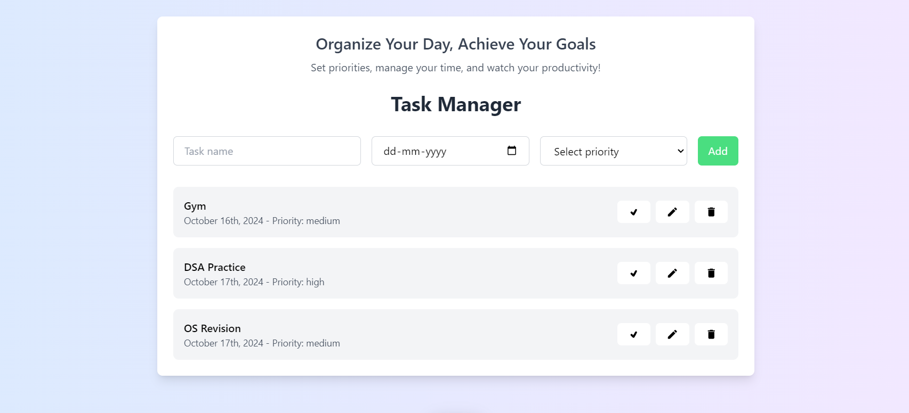

# Task Manager



Welcome to the **Task Manager** project! This is a React-based application that helps you manage your daily tasks effectively. You can add, edit, delete, and prioritize tasks, ensuring you stay on top of your goals.

## Table of Contents
- [Overview](#overview)
- [Features](#features)
- [Technologies Used](#technologies-used)
- [Installation](#installation)
- [Usage](#usage)


---

## Overview

The **Task Manager** app allows users to organize tasks based on their priority, deadline, and status (completed or not). The tasks are stored in Redux state, making the management efficient and scalable.

The project implements features like:
- Task addition, editing, and deletion
- Marking tasks as completed
- Sorting tasks by deadline and priority
- A clear and intuitive UI for better user experience

## Features

- **Add Task**: Create new tasks with a name, due date, and priority (low, medium, high).
- **Edit Task**: Modify existing tasks when priorities change or deadlines shift.
- **Delete Task**: Remove tasks that are no longer relevant.
- **Mark as Complete**: Keep track of completed tasks with a simple toggle feature.
- **Sort Tasks**: Organize tasks based on their priority or due date.

## Technologies Used

- **React.js**: For building the user interface.
- **Redux**: For state management.
- **Tailwind CSS**: For styling.
- **JavaScript (ES6)**: Core programming language.
- **Node.js**: For backend services.

## Installation

Follow these steps to get the project running on your local machine:

1. Clone the repository:
   ```bash
   git clone https://github.com/manichandra95151/task-manager.git
2. Navigate to the project directory:
   ```bash
   cd task-manager
3. Install dependencies:
   ```bash
   npm install
4. Start the development server:
   ```bash
   npm start

## Usage

- **Add Task**: Fill out the form with task details such as name, due date, and priority, then click "Add Task" to save it.
- **Edit Task**: Click the edit icon next to a task, modify the task details, and save changes.
- **Delete Task**: Task: Click the delete icon to remove the task from the list.
- **Mark as Complete**: Click the checkbox next to a task to mark it as complete or incomplete.
- **Sort Tasks**:  Use the sorting options to arrange tasks based on priority or due date


